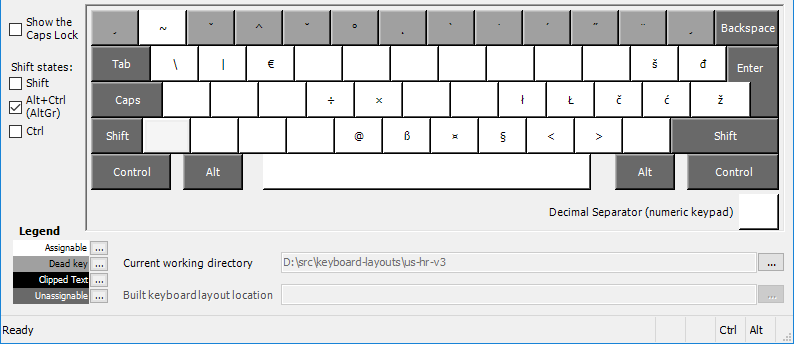
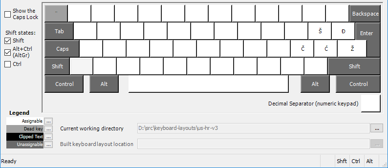
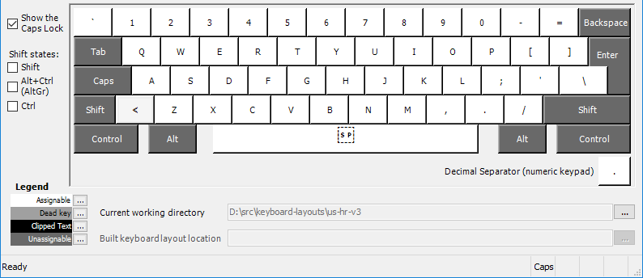
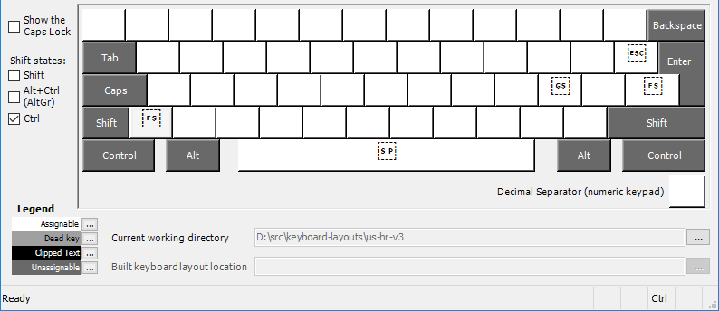

# Keyboard layouts for Microsoft Windows

This is a collection of additional non-standard keyboard layouts for Microsoft Windows.

Currently available layouts include:
Layout | Title | Source file | Setup package
-------|-------|-------------|---------------
[US layout with Croatian characters](#us-layout-with-croatian-characters) | US-HR-v3 | [US-HR_keyboard_3.klc](us-hr-v3/US-HR_keyboard_3.klc) | See Releases section

# Installing layouts
There are two ways to install keyboard layouts:
- [Run and install precompiled setup package](#installation-using-precompiled-setup-package)
- [Creating setup package yourself](#Compiling-setup-package-and-installing-from-created-setup-package)

## Installation using precompiled setup package
Download <layout>.zip package, extract it into a directory and run included _setup.exe_

You will need Administrative privileges to install new keyboard layout on Windows operating system.

## Compiling setup package and installing from created setup package
To create (compile) setup package and install selected layout you need to download and install [Microsoft Keyboard Layout Creator](https://www.microsoft.com/en-us/download/details.aspx?id=102134) (latest version is 1.4 or actually 1.4.6000.2).

Once Keyboard Layout Creator is started, load layout using _File / Load Source File..._

You can try out loaded layout using _Project / Validate layout_

Finally select _Project / Build DLL and Setup package_ to create setup files for installation.

Run _setup.exe_ to install new layout.

You will need Administrative privileges to install new keyboard layout on Windows operating system.

# Using layouts
After layout is installed simply choose it like any other existing keyboard layout that comes preinstalled, using Language settings.

For detailed instructions see: [Add input language](https://duckduckgo.com/?t=ffab&q=add+input+language+windows+10+site%3Amicrosoft.com&ia=web)

# Layouts

## US layout with Croatian characters
Title | Source file
------|------------
US-HR-v3 | [US-HR_keyboard_3.klc](us-hr-v3/US-HR_keyboard_3.klc)

It is a combination of standard US layout with option to easily type Croatian specific characters (**&#353;, &#273;, &#269;, &#263;, &#382;**).
Croatian characters are composed with AltGr + keys where those characters are placed on standard Croatian keyboard.

I was motivated to create this layout since default Croatian/HR layout is very inconvenient to use while programming and for many often used keys like "\", "{", "}", "[", "]", "/" and others you basically need two hands to type. 
Besides that, knowing how to touch-type on US layout can be very handy since US layout is almost always present or can easily be switched to if you find yourself in front of a computer with foreign regional settings.

All US keys are positioned same as on US keyboard. 
Yes, this means Y and Z are in US layout position (QWERTY), not HR layout position (QWERTZ)!

Standard Croatian keyboard layout is using AltGr key also for composing other characters (e.g. German characters: **&#0228;, &#0246;, &#0252;, &#0223;** ...). This layout has kept most of those mappings and thus enabled optimal combination of having full US layout while allowing easy access to all characters available on Croatian layout.

Here are images of layout mappings with and without modifier keys:
Modifier     | Layout
-------------|-------------
no modifier  |
Shift        |
AltGr        |
Shift + AltGr|
CapsLock     |
Control      |

# Additional Resources
[MSKLC Guide](https://msklc-guide.github.io/) contains detailed dive into Microsoft Keyboard Layout Creator peculiarities, including advanced usage.

\<End\>
